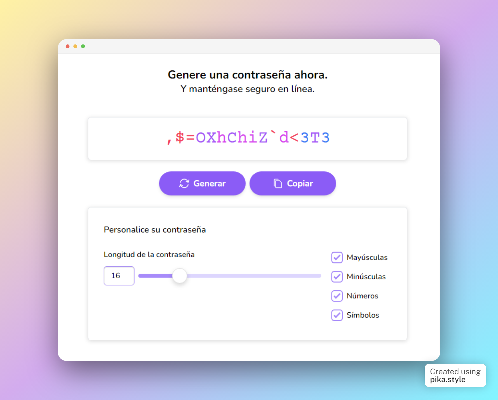

# Password Generator

	<strong>Generate strong passwords to stay safe over the internet.</strong>

> Originally made for a [*hacktoberfest* challenge](https://github.com/midudev/password-generator/). This is a migration from [my entry](https://github.com/midudev/password-generator/pull/298) to an isolated repository.

> Built with [Astro](https://astro.build/), [Solid.js](https://www.solidjs.com/), [TailwindCSS](https://tailwindcss.com/), and [TypeScript](https://www.typescriptlang.org/).

## Deploy your own

|                                                                     Cloudflare Workers                                                                      |                                                                                                 Vercel                                                                                                 |                                                            Heroku                                                            |                                                       Railway                                                       |                                                            StackBlitz                                                            |
| :---------------------------------------------------------------------------------------------------------------------------------------------------------: | :----------------------------------------------------------------------------------------------------------------------------------------------------------------------------------------------------: | :--------------------------------------------------------------------------------------------------------------------------: | :-----------------------------------------------------------------------------------------------------------------: | :------------------------------------------------------------------------------------------------------------------------------: |
|  |  |  |  |  |

